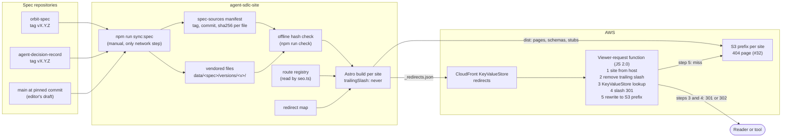

# Technical Design: Versioned, Citable Standards Site Structure for ORBIT and AgDR

**Status**: In Review (revision 2, after the Solution Architect review)
**Author**: Hisham (Tech Lead)
**Date**: 2026-09-25
**Ticket**: [#18](https://github.com/me2resh/agent-sdlc-site/issues/18)
**PRD**: None. Ticket #18 is the requirement.
**Writing standard**: ASD-STE100 (Simplified Technical English)

---

## Overview

### Summary

This design gives orbitspec.dev and agdr.dev the same 9-section structure. Each released spec version gets a permanent URL at `/spec/<version>`, and each schema is served at the URL in its `$id`. All HTML URLs have no trailing slash, as PR #30 sets. The site builds each version from files vendored from a tagged release, and an offline hash check stops drift. This extends the accepted AgDR sync design (`docs/design/2026-09-25-agdr-spec-sync.md`). Old URLs redirect with HTTP 301 from a CloudFront KeyValueStore. That lookup is part of one coordinated change to the viewer-request function, together with the #32 work. Static HTML stubs are the fallback. After approval, the build starts with PR 1 (a route registry, which is also the fix for #31).

### Goals

- Give ORBIT and AgDR the same 9 sections, in the same order, with the same URL scheme.
- Give each released spec version a permanent URL. Keep old versions readable.
- Serve each schema at the URL in its `$id`.
- Build each spec page and schema from a tagged release. Do not copy text by hand.
- Show a "status of this document" block on each spec page.
- Mark normative and informative text. Define RFC 2119 / RFC 8174 keywords.
- Remove the ORBIT duplicate concept/schema page pairs.
- Redirect each old URL to its new URL with one redirect. Break no link.
- Deliver in small PRs. Each PR can be reviewed and deployed alone.

### Non-Goals

- The agentsdlc.ai umbrella site structure. This design changes only the ORBIT and AgDR builds. PR #28 (#25) decided the home of the interoperability profile.
- Menu style and component. #26 changes the menu component. This design changes only the list of menu entries.
- Favicon, OG images, and canonical tags (#15, PR #30). This design uses the URL form and the `seo.ts` module from PR #30.
- Heading and accessibility fixes (#16).
- A validator that runs in the browser.
- Writing the spec text. The spec repositories own the text. This design only states what the site needs from them.

---

## Current State

These facts come from `main` at 440d393, a local build of the ORBIT and AgDR sites, and `gh api` reads of the spec repositories on 2026-09-25.

| Area | Fact | Effect |
|------|------|--------|
| Spec text, AgDR | The site vendors `SPEC.md`, `CHANGELOG.md`, and two schemas at commit `ddebc6d` (pinned, hash-checked, offline). `/specification` is a hand-written summary. The full text is only at `/agdr-spec.md` (raw Markdown). | A reader cannot read the spec as a web page. |
| Spec text, ORBIT | `me2resh/orbit-spec` has no `SPEC.md`. The ORBIT spec text exists only in `apps/site/src/pages/specification.astro`. | The site cannot build the ORBIT spec from a release until the text moves to the spec repository. |
| Releases, AgDR | No git tag. One GitHub Release, v1.2.0, is a **draft** that targets `e4e1a4e`. At `e4e1a4e`, `SPEC.md` is the current text without section 9, and `agdr.schema.json` is byte-identical to `main`. `SPEC.md` first appeared in 1.2.0. | To publish the draft release creates tag `v1.2.0` at the correct commit. No version before 1.2.0 has a `SPEC.md`. |
| Releases, ORBIT | No tag and no release. `package.json` says `0.1.0`. | ORBIT has no citable version. |
| Schema `$id`, ORBIT | `https://orbitspec.dev/schema/plan/v0.1.json` (and the same shape for the other three). The site serves the schemas at `/schema/plan.schema.json` and `/schema/orbit-plan.json`. The `$id` URL returns an error. | The `$id` does not resolve. |
| Schema `$id`, AgDR | `https://github.com/me2resh/agent-decision-record/schema/agdr.schema.json`. This URL is not a file URL on GitHub. | The `$id` does not resolve and has no version. |
| Duplicate pages, ORBIT | `/reconciliation` and `/schemas/reconciliation`. `/execution-slices` and `/schemas/execution-slice`. `/schemas` (HTML) and `/schema/*.json`. | Two pages with the same name and different content. |
| Cross-site files | The ORBIT build emits `/schema/agdr.schema.json`, `/agdr-spec.md`, and `/changelog.md` with the body "Not found". The AgDR build emits the ORBIT schema paths the same way. S3 serves these files with HTTP 200. #31 lists the cross-site HTML pages. | Soft 404s on the live sites. |
| URL form | Both `/path` and `/path/` return 200. PR #30 sets `trailingSlash: 'never'`, adds `seo.ts` (canonical URL function, sitemap route list, `canonicalOwner`), and adds a check that fails on a canonical URL with a trailing slash. #32 plans a CDN 301 from the slash form and a real 404. | One URL form is already selected. The design must use it. |
| Hosting | One S3 bucket, one CloudFront distribution. Each site is under a prefix (`agentsdlc/`, `orbit/`, `agdr/`). A viewer-request edge function selects the prefix from the host and maps `/path` and `/path/` to `index.html`. The infrastructure is not in this repository. | Redirects must be served at the edge or as files. |
| CI | PR #33 (#27) moves the staging deploy to `workflow_run` after "Site checks" completes. The staging deploy does not check out pull request code. Production deploys on a push to `main`. AWS values come from secrets. | New workflow steps must follow this model. |
| Validators | AgDR has `packages/validator` (`agdr-validate`). ORBIT has `bin/orbit.js` (`orbit validate`). Neither package is on npm. | The conformance page can link to the source and CLI only. |
| Licenses | Both spec repositories: CC BY 4.0 for spec text. ORBIT also has MIT for code. | The status block can state the license. |

---

## Architecture

### Build and URL flow



Mermaid validation: this diagram was rendered to SVG with `npx -y @mermaid-js/mermaid-cli` (local Chrome) on 2026-09-25, with no parse error.

### Components

| Component | Where | Purpose |
|-----------|-------|---------|
| Spec-sources manifest | `scripts/spec-sources.mjs` (replaces `scripts/agdr-spec-source.mjs`) | Records each spec version: version, tag, commit, status, date, and SHA-256 of each file. |
| Vendored files | `apps/site/src/data/<spec>/versions/<version>/` and `.../versions/draft/` | Byte-identical copies of the files at the recorded commit. |
| Route registry | `apps/site/src/lib/routes.ts` | The list of pages for each site, with the section of each page. The nav, the footer, and the build read it. `seo.ts` (PR #30) reads it for the sitemap route list. There is one route list only. |
| Redirect map | `config/redirects.ts` | Old path, new path, status code, and cache policy for each site. Generated entries (for example `/spec/latest`) come from the manifest. |
| Status block | `apps/site/src/components/SpecStatus.astro` | Renders the "status of this document" block from the manifest. |
| Spec renderer | Astro content collection with the built-in `glob()` loader over `versions/*/SPEC.md` | Renders Markdown to HTML with heading IDs. Uses no new dependency. |
| Edge function | The current viewer-request CloudFront Function plus a KeyValueStore (infrastructure) | Normalizes the URL form, returns redirects, and rewrites to the S3 prefix. One coordinated change with #32. |

---

## 1. Section Structure and URL Scheme

### 1.1 The 9 sections

Both sites use these sections in this order, in the menu and in the footer.

| # | Section | ORBIT pages | AgDR pages |
|---|---------|-------------|------------|
| 1 | Overview | `/`, `/concepts` | `/`, `/concepts`, `/related-standards` |
| 2 | Quick start | `/quick-start`, `/quick-start/adopter-guide` | `/quick-start` |
| 3 | Specification | `/spec`, `/spec/<version>`, `/spec/latest`, `/spec/draft` | same |
| 4 | Schema | `/schema`, `/schema/<record>`, JSON files at `$id` paths | same |
| 5 | Examples | `/examples`, `/examples/<record>/<slug>`, `.json` | `/examples` |
| 6 | Conformance | `/conformance` | `/conformance` |
| 7 | Implementations | `/implementations` | `/implementations` |
| 8 | Changelog | `/changelog`, `/changelog.md` | same |
| 9 | Governance and contributing | `/governance` (with `#contributing`) | same |

ORBIT records are `plan`, `project-snapshot`, `reconciliation`, and `execution-slice`. AgDR records are `agdr` and `agdr-json`.

### 1.2 Specification URLs

| URL | Content | Permanent |
|-----|---------|-----------|
| `/spec` | Index of all versions. For each version: number, status, date, link. | Yes |
| `/spec/<version>` | The full spec text of one release. `<version>` is the full SemVer number without `v`, for example `/spec/1.2.0`. | Yes. The content never changes after publication, except the status block (for example "Superseded"). |
| `/spec/<version>/spec.md` | The raw `SPEC.md` of that release, byte-identical to the tag. | Yes |
| `/spec/latest` | HTTP 302 to `/spec/<newest release>`, with `Cache-Control: no-store`. | The alias is permanent. The target changes. |
| `/spec/draft` | The editor's draft from the pinned commit on `main`. | The URL is permanent. The content changes. |
| `/spec/draft/spec.md` | The raw draft `SPEC.md`. | Same as above. |

Rules:

- `/spec/latest` is a redirect, not a copy. The reader sees the permanent URL in the address bar and cites that URL.
- "Newest release" is the highest SemVer version with status Published or Draft. It is never a pre-release, unless no other release exists.
- When a spec has no release, `/spec/latest` redirects to `/spec/draft` (Q8).
- A patch release gets its own URL. `/spec/1.2.1` and `/spec/1.2.0` are both kept.
- Astro writes `/spec/1.2.0` as `spec/1.2.0/index.html` (`build.format: 'directory'`). The edge function maps the URL to that file by the rule in 4.3.

### 1.3 Schema URLs

The URL of each schema file is the path of its `$id`. The site does not select the path. The site reads it from the schema.

- Pattern: `/schema/<record>/v<MAJOR>.<MINOR>.json`. Example: `https://orbitspec.dev/schema/plan/v0.1.json`. This is the pattern the ORBIT schemas already use.
- The version in the path is `MAJOR.MINOR`. The governance rules (section 5) forbid a schema change in a patch release. So one `MAJOR.MINOR` URL identifies one schema.
- A draft schema (not in a release) is at `/schema/<record>/draft.json`. Its `$id` in the draft commit can be the next version URL. The site serves it only at `draft.json` until the release.
- `/schema/<record>` is the reference page for that record: purpose, fields, relationships, invariants, links to each version's JSON, and links to examples.
- `/schema` is the index of records and versions. On agdr.dev, `/schema` is already a page today, so its URL does not change.

Build check: for each released schema, the check parses `$id`. The host must be the canonical host of the site, and the path must be a file in `dist/<site>/`. The file bytes must equal the vendored bytes. If not, the build fails.

Known exception: AgDR 1.2.0 has a GitHub `$id`. The site serves the 1.2.0 schema at `/schema/agdr/v1.2.json`, and the check records the exception for 1.2.0 only. The `$id` becomes an agdr.dev URL in the next AgDR release (Q3).

### 1.4 URL form

- Every HTML URL has **no trailing slash**. The site root stays `/`. This is the form that PR #30 sets (`trailingSlash: 'never'`) and checks.
- The canonical tag, `og:url`, the sitemap, every internal link, every redirect key, and every redirect target use this form.
- The edge function sends a 301 from the slash form to the form without the slash, for all URLs (#32). The redirect map does not list the slash form.
- Example URLs on ORBIT do not change: `/examples/<record>/<slug>` and `/examples/<record>/<slug>.json`.
- Section 8.4 records the URL form and the permanence rule as a decision.

---

## 2. Build From Tagged Releases

### 2.1 Source model

This design extends the accepted AgDR sync decision (option A in `2026-09-25-agdr-spec-sync.md`) from one pin to many versions. The rules of that decision stay the same: vendored copies, pinned commits, offline SHA-256 check, manual sync, no network in builds or deploys.

The manifest has one entry for each spec version:

```js
{
  spec: 'agdr',
  version: '1.2.0',            // or 'draft'
  tag: 'v1.2.0',               // null for 'draft', or for a provisional version
  commit: 'e4e1a4e1702951a1a28bae918381daa61a792b70',
  status: 'published',         // see section 3.2
  date: '2026-07-04',          // from the CHANGELOG entry of this version
  editors: ['me2resh'],
  files: [
    { source: 'SPEC.md', dest: 'apps/site/src/data/agdr/versions/1.2.0/SPEC.md', sha256: '...' },
    { source: 'schema/agdr.schema.json', dest: '.../versions/1.2.0/agdr.schema.json', sha256: '...' }
  ]
}
```

### 2.2 Checks

| Check | When | Network | Fails when |
|-------|------|---------|------------|
| Hash check (extends `check-agdr-spec-sync.mjs`) | Every PR, every deploy (`npm run check`) | No | A vendored file differs from its recorded hash, or a manifest file is missing. |
| Tag check (new) | `pull_request` events that change the manifest, and the weekly drift workflow | Yes (read-only) | The tag does not resolve to the recorded commit, or a file at the tag differs from the recorded hash. |
| New-release check (extends `agdr-spec-drift.yml`) | Weekly and manual | Yes (read-only) | The spec repository has a tag that the manifest does not list, or `main` moved past the draft pin. |
| Version check (extends #22's `check-agdr-changelog-version.mjs`) | Every PR | No | The manifest version or date differs from the vendored `CHANGELOG.md`. |

The tag check runs on the `pull_request` event only, never on `pull_request_target`. The job has `permissions: contents: read`. The spec repositories are public, so the job needs no extra token. The job reads from GitHub and never runs code from the fetched files. This follows the CI model of PR #33 (#27).

The ticket requires "a CI check fails when the site and the tag differ". The hash check proves the site equals the manifest. The tag check proves the manifest equals the tag. The tag check runs on each PR that changes the manifest, so the pair covers every change. Builds and deploys stay offline, as the accepted AgDR decision requires.

### 2.3 No tag

A spec with no tag gets no numbered version page. The site does this:

1. The site builds `/spec/draft` from a pinned commit on `main`, with status "Editor's Draft".
2. The status block says: "This is not a release. Do not cite this page as a version. The text can change."
3. `/spec/latest` redirects to `/spec/draft`.
4. The schema is at `/schema/<record>/draft.json`. If the schema `$id` names a site URL, the site also serves that URL, and the reference page marks it "Draft, not released".

Transition for AgDR 1.2.0: the draft GitHub Release v1.2.0 already targets `e4e1a4e`. The maintainer can publish it, and this creates tag `v1.2.0` (Q1). Until then, the manifest records 1.2.0 with `tag: null` and `provisional: true`. The status block then says "Source: commit e4e1a4e. The release tag is not published yet." The tag check allows `provisional: true` only for versions listed in a fixed allow list. This keeps agdr.dev at "AgDR 1.2.0 · Published" and does not undo #12.

Transition for ORBIT: the ORBIT spec text must first move to `orbit-spec/SPEC.md` (Q4). Until then, the site keeps the current `/specification` page. PR 7 changes ORBIT only after the upstream file exists.

### 2.4 Unreleased text

Unreleased text is text on `main` that is not in a release, for example AgDR section 9.

The maintainer recorded a decision in #12 (option b): keep AgDR 1.2.0 as the published version, and show section 9 as unreleased on the specification page. **This design keeps option b until the maintainer answers Q2.**

Until Q2 has an answer (default, option b):

- `/spec/1.2.0` shows the 1.2.0 text. After the 1.2.0 text, a separate block "Unreleased addendum: section 9, JSON serialisation" shows the section 9 text with the existing unreleased callout (`apps/site/src/lib/agdr-unreleased.ts`). The block is outside the versioned text and has its own heading, so a reader can see that it is not part of 1.2.0.
- `/spec/draft` shows all text on the pinned commit.
- `/specification` stays as it is today. PR 4 does not add the `/specification` redirect.

If the maintainer selects the draft-only model in Q2 (recommended by the Tech Lead and the Solution Architect):

- `/spec/<version>` shows only the text of that release. A permanent version page does not contain text that can change.
- `/spec/draft` shows all text. A callout above each section that is not in the newest release says: "Unreleased. This section is not part of AgDR <newest>. It can change." The site finds these sections by a heading diff between the draft and the newest release.
- `/spec/<newest>` shows one notice below the status block: "The editor's draft has newer text: section 9, JSON serialisation." with a link. A reader of the 1.2.0 page still sees that section 9 exists and is unreleased.
- Then PR 4 adds the `/specification` redirect.

### 2.5 Rendering

- An Astro content collection loads each `versions/*/SPEC.md` with the built-in `glob()` loader. Astro renders Markdown and adds heading IDs. This adds no dependency.
- A small local remark plugin (no new package) rewrites relative links in the vendored Markdown. `CHANGELOG.md` goes to `/changelog`. `schema/<file>` goes to the schema URL of that version. Other relative paths go to the file on GitHub at the tag. This also fixes the follow-up item named in the AgDR sync design.
- The vendored file is never edited. All changes happen at render time.
- A build check rejects vendored Markdown that contains `<script`, an inline event attribute (`on...=`), or a `javascript:` URL. See Security Considerations.

---

## 3. Status Block and Normative Marking

### 3.1 Status of this document

Each page under `/spec` shows this block below the title. The data comes from the manifest and the route registry. No value is written by hand in a page.

| Field | Example (AgDR 1.2.0) |
|-------|----------------------|
| Version | 1.2.0 |
| Status | Published |
| Date | 2026-07-04 |
| This version | `https://agdr.dev/spec/1.2.0` |
| Latest version | `https://agdr.dev/spec/latest` |
| Previous version | None |
| Editor's draft | `https://agdr.dev/spec/draft` |
| Editors | From the manifest |
| Source | `me2resh/agent-decision-record` at tag `v1.2.0` (commit `e4e1a4e`) |
| License | CC BY 4.0 |
| Feedback | A link to open an issue in the spec repository, with the version in the title |

The block also states in one sentence what the status means (see 3.2).

### 3.2 Status values

| Status | Meaning | Where |
|--------|---------|-------|
| Editor's Draft | Text on `main`. Not a release. | `/spec/draft` only |
| Draft | A tagged release before 1.0.0. It can have breaking changes in a minor version. | For example ORBIT 0.1.0 |
| Published | A tagged release at 1.0.0 or later. | The newest stable release |
| Superseded | A published release with a newer release. The text is kept. | Older versions |
| Withdrawn | A release that the editors withdrew (a "yanked" CHANGELOG entry). The text is kept with a warning. | Rare |

The site computes Superseded. The site reads Withdrawn from the CHANGELOG "yanked" marker, which `agdr-changelog.ts` already parses.

### 3.3 Normative and informative text

The spec repository owns this marking. The site renders it. The conventions:

1. The spec has a "Conformance" or "Conventions" section with this text (BCP 14): "The key words "MUST", "MUST NOT", "REQUIRED", "SHALL", "SHALL NOT", "SHOULD", "SHOULD NOT", "RECOMMENDED", "NOT RECOMMENDED", "MAY", and "OPTIONAL" in this document are to be interpreted as described in BCP 14 [RFC 2119] [RFC 8174] when, and only when, they appear in all capitals, as shown here."
2. All sections are normative, unless marked.
3. A section is informative when its heading contains "(informative)" or "Non-normative", or when its first line is "*This section is informative.*" Examples, notes, and change history are informative.

The site does this:

- It shows a "Normative" or "Informative" label next to each top-level section heading.
- It wraps each BCP 14 keyword in all capitals, outside code, in `<strong class="bcp14">`, so the reader can see it.
- A spec lint check warns when an informative section contains a BCP 14 keyword in all capitals. The check fails for new releases and warns for the draft.
- The check fails for a new release without the BCP 14 text.

Legacy: AgDR 1.2.0 cites RFC 2119 only and uses "Non-normative guidance" as a heading. The site accepts this for 1.2.0 and shows "Keywords: RFC 2119" in the status block. The next AgDR release adds the BCP 14 text.

### 3.4 Visual rules

The status block, the Normative and Informative labels, the unreleased callout, the unreleased addendum, and the "newer text" notice follow the maintainer's design rules (Option A, `docs/design/2026-09-25-option-a-rfc-register.md`):

- Use only the existing design-system tokens. The design-token check must pass.
- Do not use beige, cream, brown, or orange.
- Do not use a callout with a thick colored left border. A callout has a full 1px outline in the accent color of the standard.
- Do not use accent-colored small-caps labels. The labels use body text case and the existing text tokens.
- The UI Designer reviews each PR that adds these elements.

---

## 4. ORBIT Duplicate Pages and the Redirect Map

### 4.1 Duplicate removal

| Today | After | How |
|-------|-------|-----|
| `/reconciliation` (concept) and `/schemas/reconciliation` (reference) | `/concepts#reconciliation` and `/schema/reconciliation` | Move the concept text into one section of `/concepts`. That section links to the reference page. |
| `/execution-slices` and `/schemas/execution-slice` | `/concepts#execution-slices` and `/schema/execution-slice` | Same. |
| `/schemas/plan`, `/schemas/project-snapshot` | `/schema/plan`, `/schema/project-snapshot` | Move. `/concepts` already has a short text for these records. |
| `/schemas` (HTML index) and `/schema/*.json` | `/schema` (HTML index) and `/schema/<record>/v0.1.json` | One `/schema` tree for HTML and JSON. |

The reference page keeps `OrbitResourcePage.astro`, and the #16 heading fix stays.

### 4.2 Redirect map

Status codes:

- **301** when the old URL named one fixed thing and the new URL names the same thing.
- **302** when the old URL meant "the current version". The target changes at each release. The build generates these entries from the manifest.

Every key and every target in these tables has no trailing slash. The edge function handles the slash form for all URLs (see 4.3).

ORBIT (orbitspec.dev):

| Old URL | New URL | Code |
|---------|---------|------|
| `/specification` | `/spec/<newest>` (or `/spec/draft` before a release) | 302 |
| `/schemas` | `/schema` | 301 |
| `/schemas/plan` | `/schema/plan` | 301 |
| `/schemas/project-snapshot` | `/schema/project-snapshot` | 301 |
| `/schemas/reconciliation` | `/schema/reconciliation` | 301 |
| `/schemas/execution-slice` | `/schema/execution-slice` | 301 |
| `/reconciliation` | `/concepts#reconciliation` | 301 |
| `/execution-slices` | `/concepts#execution-slices` | 301 |
| `/adopter-guide` | `/quick-start/adopter-guide` | 301 |
| `/contribute` | `/governance#contributing` | 301 |
| `/schema/orbit-plan.json`, `/schema/plan.schema.json` | `/schema/plan/v0.1.json` | 301 |
| `/schema/project-snapshot.json`, `/schema/project-snapshot.schema.json` | `/schema/project-snapshot/v0.1.json` | 301 |
| `/schema/reconciliation.json`, `/schema/reconciliation.schema.json` | `/schema/reconciliation/v0.1.json` | 301 |
| `/schema/execution-slice.json`, `/schema/execution-slice.schema.json` | `/schema/execution-slice/v0.1.json` | 301 |
| `/schema/agdr.schema.json`, `/schema/agdr-json.schema.json`, `/agdr-spec.md` (soft-404 files today) | `https://agdr.dev/schema/agdr/v1.2.json`, `https://agdr.dev/schema/agdr-json/draft.json`, `https://agdr.dev/spec/1.2.0/spec.md` | 301 |
| `/standards` (cross-site page, #31) | `https://agentsdlc.ai/standards` | 301 |

AgDR (agdr.dev):

| Old URL | New URL | Code |
|---------|---------|------|
| `/specification` | `/spec/<newest>` | 302. Added only after Q2 has an answer (see 2.4). |
| `/agdr-spec.md` | `/spec/<newest>/spec.md` | 302 |
| `/schema/agdr.schema.json` | `/schema/agdr/v<newest MAJOR.MINOR>.json` | 302 |
| `/schema/agdr-json.schema.json` | `/schema/agdr-json/draft.json` until a release, then the release URL | 302 |
| `/integrations` | `/implementations#integrations` | 301 |
| `/adopter-guide` (cross-site page, #31) | `/quick-start` | 301 |
| `/standards` (cross-site page, #31) | `https://agentsdlc.ai/standards` | 301 |
| `/schema/plan.schema.json` and the other ORBIT paths (soft-404 files today) | The matching `https://orbitspec.dev/schema/<record>/v0.1.json` | 301 |

`/interoperability` on ORBIT and AgDR: PR #28 (#25) made it a short page that links to `https://agentsdlc.ai/interoperability`. The short page stays until the edge layer is live (PR 2b). Then the maintainer can replace it with a 301 to the agentsdlc.ai page (open question Q12).

`/changelog.md` stays on both sites. On ORBIT, it becomes a real file when the ORBIT changelog is vendored.

Map rules, checked in CI by a new `scripts/validate-redirects.mjs`:

- No key and no target has a trailing slash, except the root `/`.
- A key is not also a real page in the same build.
- An internal target is a real file in the same build.
- An external target uses one of the three canonical hosts. No other host is allowed.
- No chain and no loop. A target is never a key. The check counts the edge slash 301 as a hop: a target that ends with a slash (other than `/`) is a chain of two hops, and the check fails.
- Each URL in the URL inventory is a real page or a redirect key.

The URL inventory (`config/url-inventory/<site>.txt`) is generated in PR 1 from two sources: the build of `main` at the commit that PR 1 merges onto (before PR 1 removes any file), and the live sitemaps. It includes non-HTML files, for example `/favicon.ico`, `/favicon.svg`, `/apple-touch-icon.png`, `/og-image.png`, `/robots.txt`, `/llms.txt`, all JSON files, and all Markdown files. PR 1 regenerates it if `main` moves before the merge.

### 4.3 How redirects are served on S3 + CloudFront

S3 cannot send a 301 from a private bucket behind CloudFront. S3 website redirects need the S3 website endpoint, and the website endpoint does not work with Origin Access Control. So the redirect must happen at the edge, or the site must serve a file.

The design has two layers.

**Edge layer (primary).** The current viewer-request CloudFront Function gets a KeyValueStore. The function does these steps in this order:

1. **Select the site** from the `Host` header. An unknown host goes on as today.
2. **Remove a trailing slash** from the path, if the path is longer than `/`. Record that the original path had a slash. If the result starts with `//`, return 404. This stops a protocol-relative `Location` (an open redirect).
3. **Look up** the key `<site>|<normalized path>` in the KeyValueStore. On a hit, return the stored code, the stored target as `Location`, and the stored `Cache-Control`. This is one redirect, also when the original path had a slash.
4. **Slash 301.** If the original path had a slash, return 301 to the normalized path on the same host, with `Cache-Control: max-age=3600` for the first weeks.
5. **Rewrite** to the S3 prefix of the site. Use the file-extension rule below.

File-extension rule (step 5): the function treats the last path segment as a file only when it ends with one of a fixed list of extensions: `.json`, `.md`, `.xml`, `.txt`, `.html`, `.png`, `.ico`, `.svg`, `.jpg`, `.webp`, `.css`, `.js`, `.woff2`, `.webmanifest`. A file keeps its path. Any other path maps to `<path>/index.html`, and `/` maps to `/index.html`. The function does not treat "a dot in the last segment" as a file. So `/spec/1.2.0` maps to `spec/1.2.0/index.html`, not to an object `spec/1.2.0` that does not exist. PR 4 has a staging test for `/spec/1.2.0` (200) and `/spec/1.2.0/` (301 to `/spec/1.2.0`).

Function rules (non-functional requirements):

- Runtime: CloudFront Functions JavaScript 2.0. A KeyValueStore needs this runtime.
- The KeyValueStore lookup is in `try`/`catch`. On an error, the function continues to step 4 and step 5 (fail open to S3). A lookup failure never blocks a real page.
- A redirect in step 2, 3, or 4 returns from the viewer-request function. It adds no origin request and no S3 read.
- `Location` is either the stored target from the KeyValueStore or the normalized path on the same host. The function copies no other request value (no query string, no header) into `Location`.
- The code stays small. The map is data in the KeyValueStore, not code.

**File layer (fallback).** The build writes an HTML stub at each old HTML path (for example `schemas/plan/index.html`). The stub has `<meta http-equiv="refresh" content="0; url=<new>">`, `<link rel="canonical" href="<new>">`, `<meta name="robots" content="noindex">`, and a visible link. The stub works before the edge layer exists, on staging, and when the lookup fails open. The PR #30 sitemap check fails when a built page is not in the sitemap, so PR 2a changes that check to skip pages that have both `noindex` and a meta refresh. JSON paths cannot use a meta refresh. So, until the edge layer is live, the build keeps a byte-identical copy of each schema at its old JSON path. PR 2b removes these copies after the edge layer is verified.

**Deploy.** The build writes `dist/<site>/_redirects.json`. A workflow step writes it into the KeyValueStore after the S3 sync and before the invalidation, with the store ETag. Staging and production use separate stores.

- Staging: the step runs in the staging deploy workflow that PR #33 moves to `workflow_run`. That workflow uses the build artifact from "Site checks", does not check out pull request code, and runs only for a same-repository pull request.
- Production: the step runs only in the production workflow on `main` (a push to `main` or a manual dispatch; both need write access to this repository).
- In both workflows, the store ARN comes from a repository secret, as PR #33 does for the other AWS values. The role can use `cloudfront-keyvaluestore:DescribeKeyValueStore`, `PutKey`, `DeleteKey`, and `ListKeys` on that one store only.

**One coordinated infrastructure change (I1 + #32).** The KeyValueStore lookup (I1) and the #32 work (the slash 301 and the 404 error response) change the same viewer-request function. Do them as one change, in the order above. After this change, a removed file returns 404, not 403 and not 200.

Why a KeyValueStore and not a map in the function code: the function code limit is 10 KB, and a code change needs an infrastructure change. The KeyValueStore lets this repository change the map in a normal PR.

---

## 5. Governance and Contributing Pages

Each site gets `/governance`. It has these parts in this order:

1. **Editors and decisions.** Who the editors are. How the editors make a decision (today: the maintainer decides after public review).
2. **Propose a change.** Open an issue in the spec repository with the problem, the proposed behavior, and the affected section. The site links to the issue form with a pre-filled title.
3. **Versioning.** The spec follows SemVer, defined for a spec:
   - **Major**: a change that can make a conforming document or a conforming implementation non-conforming. Examples: a new required field, a removed enum value, a tighter body rule. (AgDR `SPEC.md` "Change history" already calls these breaking.)
   - **Minor**: a backward-compatible addition. Examples: a new optional field, a new enum value that consumers can ignore, a new serialisation.
   - **Patch**: an editorial change only. No normative change and no schema change. A CI check in the spec repository fails a patch release that changes a schema file.
   - Before 1.0.0, a minor version can contain breaking changes. The status is "Draft".
4. **Deprecation.** A feature is marked deprecated in a minor release, with a note in the spec and the CHANGELOG. It is removed no earlier than the next major release. The spec keeps a "Deprecated features" list.
5. **Contributing** (anchor `#contributing`). Examples, implementations, translations, and tool integrations. For AgDR, this is the content of `CONTRIBUTING.md`.
6. **License, code of conduct, and security.** Links to the files in the spec repository.

Source of the text: `GOVERNANCE.md` and `CONTRIBUTING.md` in each spec repository, vendored at the draft pin and rendered. Governance is not versioned with the spec, so the page shows the newest text. AgDR already has `CONTRIBUTING.md`. ORBIT has neither file. Until the upstream files exist, the site renders a governance page from a shared site template with the rules above (Q6).

The agentsdlc.ai `/governance` and `/contribute` pages do not change in this work.

---

## 6. Conformance

### 6.1 Classes and levels

The spec defines conformance, so the text is normative and lives in `SPEC.md`. The site renders the spec text and adds tooling links. The proposal to the spec repositories:

| Spec | Conformance classes | Levels |
|------|--------------------|--------|
| AgDR | Producer (writes records), Consumer (reads records), Validator (checks records) | **Core**: Markdown records (1.2.0). **Core + JSON**: adds section 9 JSON (from the release that contains section 9). |
| ORBIT | Producer, Observer, Reconciler, Executor (as the current conformance page states) | **Records**: each record is valid against its schema. **Lifecycle**: the record chain is consistent (references, revisions, provenance), as `orbit validate --all` checks. |

A conformance claim names the spec version, the class, and the level. Example: "Conforms to AgDR 1.2.0, Producer, Core."

### 6.2 Validator and test suite

- `/conformance` shows, for the newest release: the classes, the levels, how to claim conformance, and how to test.
- The validator link goes to the CLI in the spec repository at the tag: `agdr-validate` (AgDR) and `orbit validate` (ORBIT). When the packages are on npm, the page shows the `npx` command with the version pinned (Q10).
- The test suite is a set of fixtures in the spec repository: `conformance/valid/*` and `conformance/invalid/*`, each invalid fixture with the expected error. The fixtures are vendored with each version. The conformance page lists them, and each fixture has a download link.
- This repository runs the vendored fixtures against the vendored schemas in CI. This extends `validate-orbit-examples.mjs`. The check proves the site schemas and the site examples agree.

### 6.3 Implementations

- `/implementations` renders `apps/site/src/data/<spec>/implementations.json`.
- Each entry has: name, URL, spec version, class, level, evidence URL (for example a CI run with the validator), last-checked date, and "self-declared: true".
- A contributor adds an entry by PR. A CI check validates the file against a small JSON Schema in this repository.
- The page uses careful words: "claims conformance", not "is certified".
- AgDR tool integrations (today `/integrations`) move to a section of this page.

---

## 7. Implementation Plan

### 7.1 Prerequisite work outside this repository

These items are not in this repository. They block only the PRs that name them.

| Item | Where | Blocks |
|------|-------|--------|
| U1. Publish the draft release v1.2.0 (creates tag `v1.2.0` at `e4e1a4e`). | agent-decision-record | Nothing. Without it, PR 3 records 1.2.0 as provisional. |
| U2. Move the ORBIT spec text from this site to `orbit-spec/SPEC.md`, add the BCP 14 text and informative markers, add `CHANGELOG.md`. | orbit-spec | PR 7 |
| U3. Tag `orbit-spec` v0.1.0. | orbit-spec | The numbered ORBIT page in PR 7. PR 7 can ship the draft page without it. |
| U4. Add `GOVERNANCE.md` (and `CONTRIBUTING.md` for ORBIT). | both spec repositories | Nothing. The site template is the fallback. |
| U5. In the next AgDR release: set each `$id` to `https://agdr.dev/schema/<record>/v<MAJOR.MINOR>.json`, add the BCP 14 text, and release section 9. | agent-decision-record | Full `$id` acceptance for AgDR |
| U6. Add conformance fixtures under `conformance/`. | both spec repositories | The fixture list in PR 6 and PR 8. The page ships without it. |
| D1. Record the edge-redirect decision (KeyValueStore in the viewer-request function, the step order, the extension rule, fail open) as a decision note in `docs/design/`. | this repository | The I1 request. D1 is done before the request goes to the infrastructure owner. |
| I1. One change to the viewer-request function, together with #32: the KeyValueStore, the steps in 4.3, the 404 error response, and a deploy-role permission on one store per environment. | infrastructure | PR 2b |

### 7.2 PRs in this repository

Each PR is one ticket. Each PR keeps every current URL working, except the soft-404 files, which never had content. Line counts exclude vendored files.

| PR | Ticket | Title | Changes | Depends on | Size |
|----|--------|-------|---------|------------|------|
| 1 | #31 | Route registry | Add `routes.ts`. Nav, footer, and `seo.ts` read it (one sitemap route list). Build each page only for its owning site. Remove `canonicalOwner` entries for pages that are no longer built. Add `validate-routes.mjs`. Generate the URL inventory. Add `config/redirects.ts` with the entries for the removed cross-site and soft-404 URLs, and write `_redirects.json`. | PR #30 merged | ~300 lines |
| 2a | #18 | Redirect validator and HTML stubs | Add `validate-redirects.mjs` and the HTML stubs. Change the PR #30 sitemap check to skip `noindex` stubs. | PR 1 | ~200 lines |
| 2b | #18 | Edge redirects | Write `_redirects.json` into the KeyValueStore in the staging `workflow_run` deploy and in the production deploy on `main`. Staging smoke test with curl. Remove the JSON legacy copies. | PR 2a, D1, I1, PR #33 | ~120 lines |
| 3 | #18 | Multi-version spec sources | Replace `agdr-spec-source.mjs` with `spec-sources.mjs`. Move AgDR files to `versions/draft/`. Add `versions/1.2.0/` from `e4e1a4e` (or tag `v1.2.0`). Extend the hash check, the sync script, and the drift workflow. Add the tag check on `pull_request`. Keep #22's version check working. No page change. | PR 1, PR #33 | ~300 lines |
| 4 | #18 | AgDR versioned spec pages | Content collection, remark link rewrite, `SpecStatus.astro`, normative labels, BCP 14 marking, spec lint. Pages `/spec`, `/spec/1.2.0`, `/spec/draft`, raw `.md`. Section 9 as 2.4 states. Redirects for `/agdr-spec.md` and `/spec/latest`. The `/specification` redirect only after Q2. | PR 2a, PR 3, Q2 for the redirect | ~400 lines |
| 5 | #18 | AgDR schema URLs | `/schema`, `/schema/agdr`, `/schema/agdr-json`, `/schema/agdr/v1.2.json`, `/schema/agdr-json/draft.json`. `$id` check with the 1.2.0 exception. Redirects for old schema URLs. | PR 3, Q5 | ~250 lines |
| 6 | #18 | AgDR remaining sections | `/governance`, `/implementations` (with `implementations.json` and its check), `/conformance` update, `/changelog` links to each version. Nav in 9-section order. `/integrations` redirect. | PR 4, PR 5, #26, Q6 | ~350 lines |
| 7 | #18 | ORBIT versioned spec and schemas | Vendor `orbit-spec` in the manifest. Build `/spec/draft` (and `/spec/0.1.0` after U3), `/schema/<record>/v0.1.json`, and examples from the vendored files. Replace `specification.astro`. Redirects for `/specification` and old JSON URLs. | PR 4, PR 5, U2, Q4, Q8 | ~350 lines |
| 8 | #18 | ORBIT duplicate removal and remaining sections | Move `/schemas/<record>` to `/schema/<record>`. Merge `/reconciliation` and `/execution-slices` into `/concepts`. Move the adopter guide. Add `/governance` and `/implementations`. Nav in 9-section order. All ORBIT redirects in 4.2. | PR 7, #16, #26 | ~400 lines |

Order: 1 → 2a → 3 → 4 → 5 → 6 → 7 → 8. PR 2b can merge at any time after 2a, when D1 and I1 are done.

Soft-404 URLs in PR 1: PR 1 removes the cross-site files and adds their redirect entries in the same PR, so the map and the inventory are complete from the first deploy. The entries take effect at the edge only after PR 2b. Until then, these URLs return 403, or 404 after I1 and #32. This is acceptable, because these files only contained the text "Not found". Real cross-site HTML pages (for example `/standards` on ORBIT) also get an HTML stub in PR 2a. So deploy PR 1 and PR 2a in the same release window, with no other deploy between them.

### 7.3 Relation to parallel work

| Item | Relation | Rule |
|------|----------|------|
| #15, PR #30 (canonical URLs, sitemaps, `seo.ts`) | PR #30 adds `seo.ts` with the canonical URL function, the sitemap route list, and `canonicalOwner`. It sets `trailingSlash: 'never'` and adds `validate-sitemaps.mjs`. | This design uses the no-slash form (1.4). PR 1 merges after PR #30. PR 1 changes `seo.ts` to read the route list from `routes.ts`. `seo.ts` keeps the canonical URL function. There is only one route list. PR 2a changes `validate-sitemaps.mjs` to skip `noindex` stubs. |
| #31 (cross-site pages) | #31 asks to build each page only for its owning site, to remove the `canonicalOwner` workaround for pages that are no longer built, and to add a registry check. | **#31 is the ticket for PR 1.** PR 1 is titled for #31 and closes it. PR 1 removes the `canonicalOwner` entries for all pages that it stops building. The one remaining entry is `/interoperability` on ORBIT and AgDR (the PR #28 short page). That entry is removed when the short page becomes a 301 after PR 2b (Q12). Then `canonicalOwner` is deleted. |
| #32 (404 and slash 301) | #32 changes the same viewer-request function as I1. | I1 and #32 are **one** coordinated infrastructure change, in the step order in 4.3. After it, a removed file returns 404. |
| #27, PR #33 (CI hardening) | PR #33 moves the staging deploy to `workflow_run`, moves AWS values to secrets, and pins actions. | PR 2b adds the KeyValueStore write only to the staging `workflow_run` deploy and to the production deploy on `main`, with the store ARN in a secret and a role scoped to one store. The tag check (PR 3) runs on `pull_request` with `contents: read`, never on `pull_request_target`. New actions are pinned to a full commit SHA. |
| #16 (headings, skip link) | PR 8 moves `OrbitResourcePage` to a new URL. | PR 8 keeps the #16 changes. It moves the page and does not rewrite it. |
| #22 (AgDR version module) | PR 3 and PR 4 read the version from the manifest. | PR 3 keeps `agdr-changelog.ts` as the reader of the vendored CHANGELOG. The manifest adds data. The #22 checks stay in `npm run validate`. |
| #25, PR #28 (interoperability) | PR #28 keeps the full profile on agentsdlc.ai and shows a short page on ORBIT and AgDR. | The route registry lists the short page for ORBIT and AgDR. A change to a 301 waits for PR 2b and Q12. |
| #26 (ORBIT menu) | PR 6 and PR 8 change the menu entries. | They change only the entry list in the route registry, not the component. |

---

## 8. Risks, Trade-offs, and Alternatives

### 8.1 Risks

| Risk | Likelihood | Impact | Mitigation |
|------|------------|--------|------------|
| **Browser-cached 301s (point of no return).** A browser caches a 301 with no end date. A wrong 301 is hard to remove after readers get it. | Medium | High | For the first weeks after an entry is added, each 301 has `Cache-Control: max-age=3600`. The KeyValueStore value holds the cache policy for each entry. After the period, the entry can move to a longer `max-age`. The `/spec/latest` 302 always has `Cache-Control: no-store`. Rollback before the point of no return: deploy the previous `_redirects.json`. |
| The upstream items (U2, U3) do not happen, so ORBIT stays without a release. | Medium | High | ORBIT gets the draft page, the status block, and the URL scheme anyway. The numbered page waits. PR 7 does not block PR 8. |
| The infrastructure change (I1 with #32) is late. | Medium | Medium | The HTML stubs and the JSON copies keep the old URLs working. Only the status code differs (200 with a refresh, not 301). |
| The edge function treats `/spec/1.2.0` as a file because of the dot. | Medium | High | The fixed extension list in 4.3. A staging test in PR 4. |
| The KeyValueStore lookup fails. | Low | Medium | `try`/`catch` and fail open to S3. Real pages still load. Old URLs then get the HTML stub (fallback) or a 404. |
| A schema tool does not follow a 301 for a JSON URL. | Low | Medium | Most HTTP clients follow redirects. The PR 2b smoke test fetches each old JSON URL with `curl -L` and with Node `fetch`. If a known tool fails, keep the JSON copies. |
| The section 9 location changes a recorded maintainer decision. | Medium | Low | The design keeps option b until Q2 has an answer. |
| A tag moves after the site vendors it. | Low | High | The weekly tag check fails. The hash check stops the build from using changed files. |
| Vendored Markdown contains unsafe HTML. | Low | High | The build check rejects scripts, event attributes, and `javascript:` URLs. Hash pinning makes each change visible in a PR. |
| A protocol-relative `Location` (open redirect) from a path like `//host/`. | Low | High | Step 2 in 4.3 returns 404 when the normalized path starts with `//`. |
| A reader cites `/spec/latest`. | Medium | Low | `/spec/latest` is a 302. The address bar shows the permanent URL. Each page shows "Cite this version" with the permanent URL. |

### 8.2 Trade-offs

- **Manual sync.** New upstream text reaches the site only when a person moves the pin. This is the same trade-off that the accepted AgDR sync design made. The weekly check makes the delay visible.
- **More files.** Each version adds vendored files. The files are small (the AgDR set is under 40 KB).
- **Section 9 location.** A version page that shows only released text is more correct for citation. The design keeps option b until the maintainer decides.
- **Schema version is `MAJOR.MINOR`.** This keeps the ORBIT `$id` values and needs a rule that a patch never changes a schema.
- **No trailing slash.** The directory-style URLs look like files when the last segment has a dot (`/spec/1.2.0`). The extension rule handles this. The benefit is one URL form with PR #30 and one set of search signals.

### 8.3 Alternatives considered

| Option | Pros | Cons | Result |
|--------|------|------|--------|
| **A. Vendored files per version, pinned to tags, offline hash check, edge redirects from a KeyValueStore (chosen)** | Uses the accepted AgDR sync model. Builds and deploys stay offline. Every text change is a reviewed PR. Real 301s for HTML and JSON. | Manual sync. One infrastructure change. | Chosen |
| B. Fetch each tag at build time | No vendored files. New tags appear with no PR. | Builds and deploys depend on GitHub. The accepted AgDR decision rejected this for the same reason. | Rejected |
| C. Git submodules pinned to tags | Pins are native to git. | One submodule per version, or worktrees in CI. Submodule checkout in a privileged workflow adds a credential risk. No simple way to prove a file equals the tag. | Rejected |
| D. npm packages of the spec repositories as dependencies | Versions come from the lockfile. | One version per package, so old versions need npm aliases. The packages are not on npm. | Rejected for now. Can replace the sync step later. |
| E. A docs framework with versioned docs (Docusaurus, Starlight) | Version menus built in. | A new framework and a re-platform of three sites. The design system (Option A) would need a port. | Rejected |

Redirect options:

| Option | Pros | Cons | Result |
|--------|------|------|--------|
| KeyValueStore lookup in the current function, with HTML stubs as fallback (chosen) | Real 301/302 for all types. The map changes by a PR in this repository. One redirect per request. | One infrastructure change, done together with #32. | Chosen |
| Map in the function code | No new AWS resource. | 10 KB code limit. Each map change needs an infrastructure change. | Rejected |
| S3 website redirect metadata | No code. | Needs the S3 website endpoint, which does not work with Origin Access Control. | Rejected |
| Lambda@Edge | Full runtime. | Deploys in one fixed region, higher cost and latency, more to operate. | Rejected |
| HTML meta-refresh stubs only | No infrastructure change. | HTTP 200, not 301. Does not work for JSON. | Kept as the fallback only |

URL form options:

| Option | Pros | Cons | Result |
|--------|------|------|--------|
| No trailing slash, root `/` (chosen) | Same as PR #30 and its check. One set of search signals. #32 already plans the 301. | Needs the extension rule for dotted segments. | Chosen |
| Trailing slash | Directory URLs map to `index.html` with no rule. | Conflicts with PR #30 and its check. A second change sends search engines a third signal. | Rejected |

### 8.4 Decisions to record

The repository keeps decision notes in `docs/design/`. These decisions are material. Each is recorded as a decision note at the time shown:

| Decision | Recorded when |
|----------|---------------|
| **URL form and permanence.** Every HTML URL has no trailing slash (root `/`). The slash form gets a 301 at the edge. A published `/spec/<version>` URL and a released schema `$id` URL never change and never go away. Their content never changes, except the status block. A removed page gets a 301. | After this design is approved, before PR 1 merges. |
| **Edge redirects (D1).** KeyValueStore lookup in the viewer-request function, the step order and the extension rule in 4.3, fail open, cache policy. | Before the I1 request goes to the infrastructure owner. |
| **Multi-version vendoring and the tag check.** Extends the accepted AgDR sync decision. | In PR 3. |
| **Schema URL rule.** `/schema/<record>/v<MAJOR.MINOR>.json`, and a patch never changes a schema. | In PR 5, after Q5. |

---

## Security Considerations

- [x] No user input. The sites are static.
- [x] Supply chain: vendored text is pinned by hash. A change is visible in a PR.
- [ ] Rendered Markdown: the build rejects `<script`, inline event attributes, and `javascript:` URLs in vendored files (PR 4).
- [ ] Redirect targets: only internal paths and the three canonical hosts. The function puts only a stored target or the normalized same-host path in `Location`. A path that starts with `//` after normalization returns 404 (I1, PR 2a).
- [ ] KeyValueStore access: the deploy role gets write access to one store per environment only. The store ARN is a repository secret (I1, PR 2b).
- [ ] The KeyValueStore write runs only in the staging `workflow_run` deploy (no pull request code, same-repository pull requests only) and in the production deploy on `main` (PR 2b).
- [ ] The tag check runs on `pull_request` with `contents: read`, never on `pull_request_target`. It needs no extra token and never runs code from the fetched files (PR 3).
- [x] No secrets in this design. No PII.

---

## Testing Strategy

| Type | What | Where |
|------|------|-------|
| Build checks | Route registry equals the dist files. No cross-site files. `seo.ts` reads the registry. | `validate-routes.mjs` (PR 1) |
| Build checks | Redirect map: no slash in keys or targets, targets exist, no chains (the slash 301 counts as a hop), no loops, allowed hosts, URL inventory covered. | `validate-redirects.mjs` (PR 2a) |
| Build checks | PR #30 sitemap check passes with the `noindex` stubs skipped. | `validate-sitemaps.mjs` (PR 2a) |
| Build checks | Hash check, version check, `$id` path check, status block on each spec page, BCP 14 lint, unsafe HTML check, design-token check. | `npm run check` and `npm run validate` (PR 3, 4, 5) |
| Network checks | Tag check on `pull_request` when the manifest changes. Weekly drift and new-release check. | GitHub Actions (PR 3) |
| Fixture checks | Vendored examples and fixtures validate against vendored schemas. | Extends `validate-orbit-examples.mjs` (PR 6, 7) |
| Link check | All internal links in `dist/` resolve to a file or a redirect key. | Extends `validate-site.mjs` (PR 1) |
| Staging smoke | For each redirect: `curl -sI` returns the expected code, `Location`, and `Cache-Control`. `/old/` with a slash returns one redirect to the final target. For each `$id`: `curl -s` returns the schema. | Staging deploy (PR 2b) |
| Staging smoke | `/spec/1.2.0` returns 200. `/spec/1.2.0/` returns 301 to `/spec/1.2.0`. `/spec/1.2.0/spec.md` returns the raw file. | Staging deploy (PR 4) |
| Manual | Status block, labels, callout, and menu at 1440 px and 390 px, light and dark mode. | Each UI PR, with UI Designer review |

---

## Acceptance Criteria per PR

### PR 1: Route registry (ticket #31)

- [ ] `apps/site/src/lib/routes.ts` lists each page of each site with its section.
- [ ] The nav, the footer, and `seo.ts` read the registry. `seo.ts` has no second route list.
- [ ] Each site build contains only the pages that the registry assigns to that site. The ORBIT build emits no AgDR file, and the AgDR build emits no ORBIT file.
- [ ] `canonicalOwner` has no entry for a page that is no longer built.
- [ ] `config/url-inventory/<site>.txt` lists every URL, HTML and non-HTML, from the build of the base commit and the live sitemaps.
- [ ] `config/redirects.ts` has an entry for each removed cross-site or soft-404 URL. No key or target has a trailing slash.
- [ ] `validate-routes.mjs` runs in `npm run validate` and fails when a built file is not in the registry.
- [ ] The PR #30 checks still pass. All pages in the registry render as before.

### PR 2a: Redirect validator and HTML stubs

- [ ] The build writes `dist/<site>/_redirects.json` and an HTML stub at each old HTML path, with canonical link and `noindex`.
- [ ] `validate-redirects.mjs` fails on a trailing slash in a key or target, a missing target, a chain (the slash 301 counts as a hop), a loop, a foreign host, a key that is also a page, or an inventory URL with no page and no redirect.
- [ ] The PR #30 sitemap check skips pages with `noindex` and a meta refresh, and still fails for any other page that is not in the sitemap.
- [ ] PR 1 and PR 2a deploy in the same release window.

### PR 2b: Edge redirects

- [ ] D1 is recorded, and I1 (with #32) is live on staging and production.
- [ ] The staging `workflow_run` deploy and the production deploy on `main` write the map into their own KeyValueStore. The store ARN comes from a secret. New actions are pinned to a full commit SHA.
- [ ] On staging, each map entry returns the expected code, `Location`, and `Cache-Control` (`max-age=3600` for a new 301, `no-store` for `/spec/latest`).
- [ ] On staging, a slash-form old URL returns one redirect to the final target.
- [ ] Old JSON schema URLs return 301 to the `$id` URL. The JSON copies are removed.

### PR 3: Multi-version spec sources

- [ ] `scripts/spec-sources.mjs` records each version with tag, commit, status, date, editors, and file hashes.
- [ ] AgDR has entries `1.2.0` (from `e4e1a4e` or tag `v1.2.0`) and `draft` (from `ddebc6d`).
- [ ] `npm run check` fails on a changed vendored file, with no network use.
- [ ] The tag check fails when a tag does not resolve to the recorded commit. It runs on `pull_request` with `contents: read` when the manifest changes.
- [ ] The weekly workflow fails when upstream has a tag that the manifest does not list.
- [ ] The #22 version check still passes. No page output changes.

### PR 4: AgDR versioned spec pages

- [ ] `/spec`, `/spec/1.2.0`, `/spec/draft`, `/spec/1.2.0/spec.md`, and `/spec/draft/spec.md` exist on agdr.dev.
- [ ] `/spec/1.2.0/spec.md` is byte-identical to `SPEC.md` at the 1.2.0 source commit.
- [ ] `/spec/latest` redirects (302, `no-store`) to `/spec/1.2.0`.
- [ ] Each spec page has a status block with all fields in 3.1, from the manifest.
- [ ] Each top-level section has a Normative or Informative label. BCP 14 keywords are marked.
- [ ] The status block, labels, callout, and notice follow 3.4, and the UI Designer approves them.
- [ ] Section 9 shows as 2.4 states for the Q2 answer. Before an answer: the unreleased addendum on `/spec/1.2.0`, and `/specification` unchanged with no redirect.
- [ ] Relative links in the rendered spec resolve.
- [ ] `/agdr-spec.md` redirects as in 4.2.
- [ ] Staging test: `/spec/1.2.0` returns 200, and `/spec/1.2.0/` returns 301 to `/spec/1.2.0`.

### PR 5: AgDR schema URLs

- [ ] `/schema/agdr/v1.2.json` returns the 1.2.0 schema bytes.
- [ ] `/schema/agdr-json/draft.json` returns the draft schema and is marked unreleased on the reference page.
- [ ] The `$id` check passes, with the 1.2.0 exception recorded in one place.
- [ ] Old schema URLs redirect as in 4.2.

### PR 6: AgDR remaining sections

- [ ] The AgDR menu shows the 9 sections in order.
- [ ] `/governance` has the six parts in section 5, with `#contributing`.
- [ ] `/implementations` renders `implementations.json`, and a check validates the file.
- [ ] `/conformance` shows classes, levels, the validator link at the tag, and the fixture list if U6 exists.
- [ ] `/changelog` links each version to `/spec/<version>`.
- [ ] `/integrations` redirects to `/implementations#integrations`.

### PR 7: ORBIT versioned spec and schemas

- [ ] The manifest has ORBIT `draft` (and `0.1.0` after U3).
- [ ] `/spec/draft` renders `orbit-spec/SPEC.md` with the status block.
- [ ] `/schema/<record>/v0.1.json` returns each ORBIT schema, and the `$id` check passes with no exception.
- [ ] Examples come from the vendored files, not from hand copies.
- [ ] `/specification` and old JSON URLs redirect as in 4.2.

### PR 8: ORBIT duplicate removal and remaining sections

- [ ] No two ORBIT pages describe the same record. `/concepts` links to each `/schema/<record>` page.
- [ ] The ORBIT menu shows the 9 sections in order.
- [ ] `/governance` and `/implementations` exist.
- [ ] Every ORBIT old URL in 4.2 redirects, and the link check passes.

### Ticket-level acceptance (after PR 8 and the upstream items)

The ticket acceptance criteria in #18 are met when PR 1 to PR 8 are merged and U1, U2, U3, and U5 are done. Without U5, the AgDR `$id` criterion stays open for 1.2.0 only.

---

## Open Questions

Grouped by the first PR that each question blocks. The recommended answers come from the Tech Lead and the Solution Architect review.

| # | Blocks | Question | Recommended answer | Status |
|---|--------|----------|--------------------|--------|
| Q9 | PR 1 | URL form | No trailing slash, root `/`, as in PR #30. | **Closed.** Adopted in 1.4. |
| Q7 | PR 2b | Approve the KeyValueStore, the change to the viewer-request function, and the deploy-role permission (I1)? | Approve. Do it as one change with the #32 404 page and slash 301, in the order in 4.3. Scope the role to one store per environment. | Open |
| Q12 | PR 2b follow-up | Replace the `/interoperability` short page on ORBIT and AgDR (PR #28) with a 301 to agentsdlc.ai after the edge layer is live? | Yes. Then delete `canonicalOwner`. | Open |
| Q2 | PR 4 | Section 9 location: draft page only, with a notice on `/spec/1.2.0`? Or keep option b (unreleased addendum on the 1.2.0 page)? | Draft page only, with the notice. Until you answer, the design keeps option b and keeps `/specification` unchanged. | Open |
| Q11 | PR 4 | Who are the listed editors for each spec? | The maintainer alone for both specs, until the governance text names more. | Open |
| Q5 | PR 5 | Accept the schema URL rule `v<MAJOR.MINOR>.json`, with "a patch release never changes a schema"? | Accept. Add the CI check in the spec repositories. | Open |
| Q6 | PR 6 | Governance text in each spec repository (`GOVERNANCE.md`), or on the site only? | `GOVERNANCE.md` in each spec repository. The site template is the fallback. | Open |
| Q4 | PR 7 | Move the ORBIT spec text to `orbit-spec/SPEC.md`, then tag v0.1.0? Who reviews the moved text? | Yes. The maintainer reviews the moved text. Tag v0.1.0 after that. | Open |
| Q8 | PR 7 | When a spec has no release, should `/spec/latest` redirect to `/spec/draft` or return 404? | 302 to `/spec/draft`. A 404 on a documented alias is worse. The draft status block says "not a release". | Open |
| Q1 | No PR | Publish the draft AgDR release v1.2.0 (creates tag `v1.2.0` at `e4e1a4e`)? | Yes, now. It removes the provisional exception in PR 3. | Open |
| Q3 | No PR (ticket closure) | In the next AgDR release, change each `$id` to `https://agdr.dev/schema/<record>/v<MAJOR.MINOR>.json`? Is that release 1.3.0? | Yes. 1.3.0, a minor release that adds section 9. | Open |
| Q10 | No PR | Publish the AgDR and ORBIT validators on npm? | Not now. Link the CLI at the tag. Publish later. | Open |

---

## Diagram Validation

The Mermaid diagram in "Build and URL flow" was rendered to SVG with `npx -y @mermaid-js/mermaid-cli` on 2026-09-25. The render used the local Chrome, because the bundled headless Chrome was not installed. The render had no parse error.

---

## Approvals

| Role | Name | Date | Status |
|------|------|------|--------|
| Tech Lead | Hisham | 2026-09-25 | Author |
| Solution Architect | Tariq | 2026-09-25 | Changes requested on revision 1. Revision 2 addresses B1, B2, and the 8 non-blocking items. |
| Maintainer | me2resh | | Pending |
| Platform (edge redirects, D1, I1) | Adel | | Pending |
